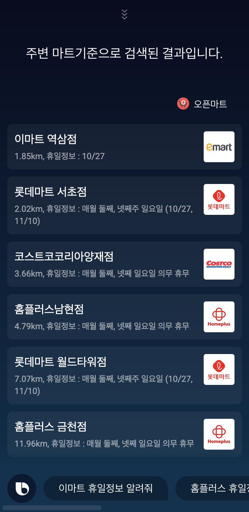
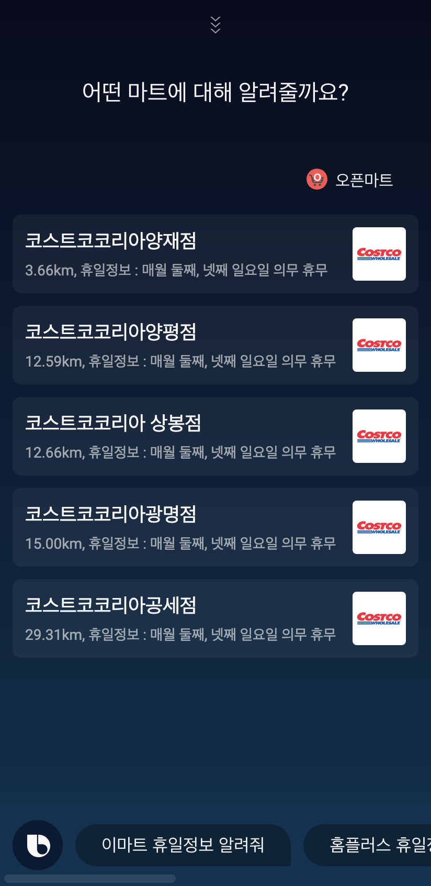
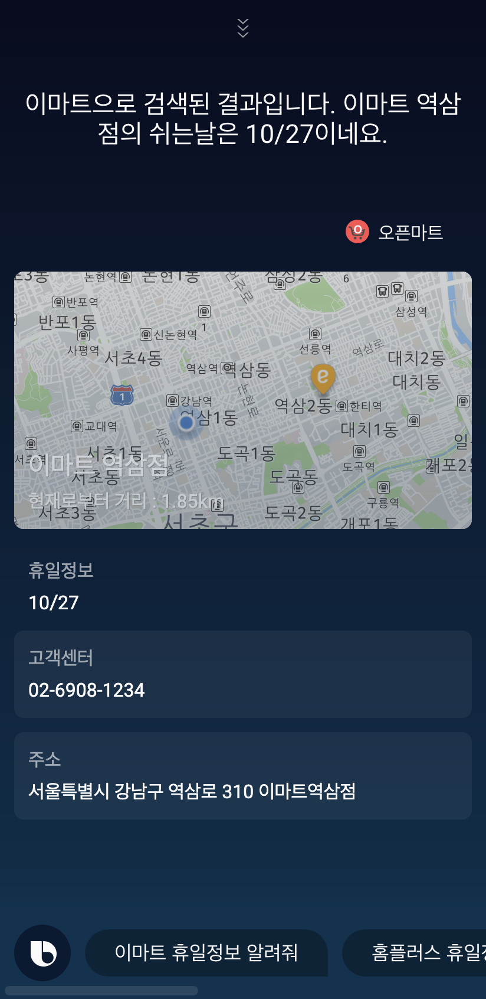

# 오픈마트
## 1.캡슐소개
- 매번 기억하기 어려운 대형마트 휴일정보. 이제는 오픈마트에게 물어 볼 수 있습니다. 
- 근처에 있는 모든 마트나 특정 대형마트(이마트, 롯데마트, 홈플러스, 코스트코)의 휴일정보를 물어볼 수 있습니다.

## 2. 주요기능
- 근처 대형마트의 휴일정보 제공
- 특정 대형마트의 휴일정보 제공
- 상세 마트정보화면
  - 대형마트의 휴일정보 제공
  - 사용자의 현재위치와 해당마트와의 거리정보 지도제공
  - 전화걸기 및 지도 웹사이트로 이동기능 제공

## 3. 스크린샷
| 주변 대형마트 검색결과                                                                               | 코스트코 검색결과                                                                                | 이마트 검색 상세결과                                                                                |
| ---------------------------------------------------------------------------------------------- | ----------------------------------------------------------------------------------------------- | ----------------------------------------------------------------------------------------------- |
| [](./screenshots/screenshot-all.png) | [](./screenshots/screenshot-select.png) | [](./screenshots/screenshot-detail.png) |

## 4. 발화예시
```
"오픈마트에서, 이마트 오늘 문 열었어?"
"오픈마트에서, 이마트 양재점 문 열었어?"
"오픈마트에서, 근처에 문 연 이마트 알려줘"
"오픈마트에서, 홈플러스 오늘 문 열었어?"
"오픈마트에서, 롯데마트 오늘 문 열었어?"
"오픈마트에서, 코스트코 휴일정보 알려줘"
"오픈마트에서, 근처마트 문 연 마트 알려줘"
```

## 5. 개인정보처리방침
[개인정보처리방침](https://github.com/applepie1130/open-mart-bixby/blob/master/privacy-policy.adoc)

## 6. Contact
e-mail : arduous1130@gmail.com
